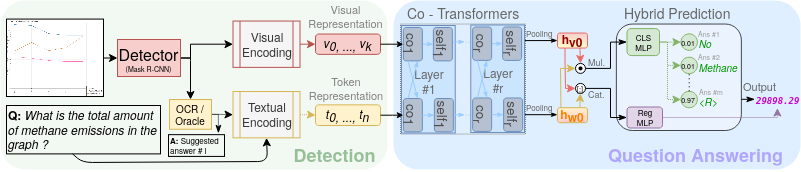

#  [ECCV 2022] Classification-Regression for Chart Comprehension
#### [[Project Page](https://www.vision.huji.ac.il/crct/) | [Paper (arxiv)](https://arxiv.org/abs/2111.14792)] #### 
<a href="https://opensource.org/licenses/MIT"></a>
<a href="https://pytorch.org/">=1.6.0-Red?logo=pytorch"></a>

#### Published in European Conference on Computer Vision 2022.

> [Classification-Regression for Chart Comprehension](https://arxiv.org/abs/2111.14792) <br />
> **Matan Levy, Rami Ben-Ari, Dani Lischinski**<br /><br />
> **Abstract:** Chart question answering (CQA) is a task used for assessing chart comprehension, which is fundamentally different from understanding natural images. CQA requires analyzing the relationships between the textual and the visual components of a chart, in order to answer general questions or infer numerical values. Most existing CQA datasets and models are based on simplifying assumptions that often enable surpassing human performance. In this work, we address this outcome and propose a new model that jointly learns classification and regression. Our language-vision setup uses co-attention transformers to capture the complex real-world interactions between the question and the textual elements. We validate our design with extensive experiments on the realistic PlotQA dataset, outperforming previous approaches by a large margin, while showing competitive performance on FigureQA. Our model is particularly well suited for realistic questions with out-of-vocabulary answers that require regression.
<hr />


**Fig 3**: Our Classification - Regression Chart Transformer (CRCT) network architecture consists  
of two stages of detection and question answering. The detection stage (left) provides bounding  
boxes and object representations of the visual and textual elements (see Fig. 2). These features,  
along with the question text, enable the co-transformers in the second stage (right) to fuse both  
visual and textual information into a pooled tuple of two single feature vectors {hv0 , hw0 }. Next,  
our hybrid prediction head containing two different MLPs, outputs a classification score and a  
regression result. co_i/self_i: co/self attention at block i.
## Citation ##
In case you find this useful, please cite:
``` 
@inproceedings{levy2022crct,
  title={Classification-Regression for Chart Comprehension},
  author={Levy, Matan and Ben-Ari, Rami and Lischinski, Dani},
  booktitle={European Conference on Computer Vision (ECCV)},
  year={2022}
  }
```
# Getting Started #

### Virtual Environment ###
Follow these steps:
1. Set `name: your_env_name` in **CRCT/environment.yml**.
2. Install environment via conda: `conda env create -f CRCT/environment.yml`.
3. Install **Detectron2**  repository (from [here](https://github.com/facebookresearch/detectron2/blob/main/INSTALL.md)).

## Downloads ##
### Dataset ###  
The raw **PlotQA** dataset is available [here](https://github.com/NiteshMethani/PlotQA).
- [Extended detection annotations](https://drive.google.com/drive/folders/1N5TFoNxvQxNhveq-soU_n78qzibWfkDw?usp=sharing): extended annotations with segmentation masks for Mask-RCNN, in COCO format.

### Dataset Features ###
- [Post-Detection features](https://drive.google.com/drive/folders/1izDliZozv9ArdVNmWUQWGMNKPqw7Pf79?usp=sharing): PlotQA images features, extracted from a pretrained Mask-RCNN.
- [Q&As files in .npy format](https://drive.google.com/drive/folders/1VoJVGbquD6apGiecscDf4rOSX6Ih6-D3?usp=sharing): PlotQA data Q&As converted to numpy **.npy** format.

    `qa_pairs_V1_train_10%.npy`: A randomly selected 10% subset of the original V1 Question-Answers file.
    `qa_pairs_test.npy`: PlotQA test Question-Answers file.
### Model Weights ###
- [Pretrained CRCT weights](https://drive.google.com/drive/folders/10eXEpJPA_p1jMte6mldkN3qLpP70xkH-?usp=sharing): trained on the extracted features from above.
- [Pretrained Mask-RCNN weights](https://drive.google.com/drive/folders/1p-NUAmsYuAf_RWP2MTh4LM05oiS4bY7Y?usp=sharing): trained on the extended annotations from above.

<hr />

### Config ###
The PlotQA config is in `CRCT/config/plotqa.json`. Set the line `"main_folder": "My/full/path/to/CRCT/",` with your own path to the CRCT folder.
<br />For more details see [CRCT/config/README.md](CRCT/config/README.md).
## Training ##
### Detection Stage: training Mask-RCNN ###
For training your own Mask-RCNN on PlotQA images, use:
<pre>cd Detector
python frcnn.py --output MyDetector --batch-size 128 --num-gpus 4</pre>
For more details, see [Detectorn2](https://github.com/facebookresearch/detectron2).
### Question-Answering Stage: training CRCT ###
Use the following command for training your own model:<br />
<pre>python train.py -qa_file qa_pairs_V1_10%.npy -dataset_config config/plotqa.json -batch_size 80 -save_name MyOwnCRCT -num_workers 2 -ddp -world_size 4 -num_proc 4 -L1</pre>
- `-qa_file`: The Q&As file, in .npy format.
- `-dataset_config`: path to the config file.
- `-ddp`: A flag for training with PyTorch's [Distributed Data Parallel](https://pytorch.org/tutorials/intermediate/ddp_tutorial.html).
- `-world_size`: number of GPUs.
- `-num_proc`: number of processes on each machine. For training on a single machine, set it equal to `world_size`.
- `-L1`: Training the regression head with L1 loss. Otherwise, L1Smooth will be applied.
- `-dist_url` Distributed data parallelization file url. **Make Sure it isn't exists before training!**.

For more details, check `options.py`.

## Evaluation ##
For evaluate a model , use the following command:
<pre>python evaluation.py -continue -qa_file qa_pairs_test.npy -num_workers 2 -ddp -world_size 4 -num_proc 4 -save_name MyEvalFolderCRCT -eval_set test -start_checkpoint crct.ckpt</pre>
- `-start_checkpoint`: weights file in `CRCT/checkpoints/`.
- `-eval_set`: choose test/val/train.
- `-continue`: This flag will raise an error in case the weights are not suitable to the model.
## Interactive Demo ##
Try the CRCT model yourself. Download weights/features/Q&As from above, and run:
<pre>cd CRCT<br />python Interactive_demo.py</pre>
<hr />

### Examples ###
For inference examples, please visit the Project page at [https://www.vision.huji.ac.il/crct/](https://www.vision.huji.ac.il/crct/).

## Acknowledgements ##
- Backbone was built on Jiasen Lu's [ViLBERT](https://github.com/jiasenlu/vilbert_beta), and Vishvak's [implementation](https://github.com/vmurahari3/visdial-bert).<br />
- We wish to thank Nir Zabari and Or Kedar for their assistance in parts of this
research.
- Part of this research was conducted during an internship at IBM Research AI, Haifa.
